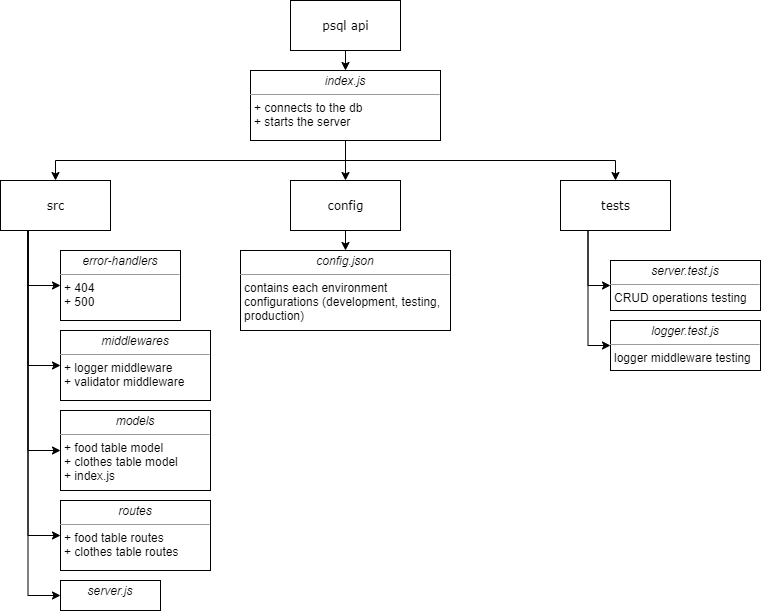

# basic-api-server

## Description

This is a basic Express.js api that uses PostgreSQL to manage data of two tables: Food and Clothes.

* *Food table schema*: { item: "//food item name", "calories": "//calories in the food item"}
* *Clothes table schema*: { category: "//clothing item category", "brand": "//clothing item brand"}

The following CRUD operations can be performed on both tables using `/food` and `/clothes` endpoints:

* Reading all the records
* Read a specific record -> require using the record's id
* Adding a new record -> require using a body
* Updating an existing record -> require using a body and the record's id
* Deleting an existing record -> require using the record's id

## Links

Heroku deployment: https://hasnaa-basic-api-server.herokuapp.com/
Food api link: https://hasnaa-basic-api-server.herokuapp.com/food
Clothes api linkL https://hasnaa-basic-api-server.herokuapp.com/clothes
Pull requests from dev to main: https://github.com/hasnaa38/basic-api-server/pull/1

## UML

